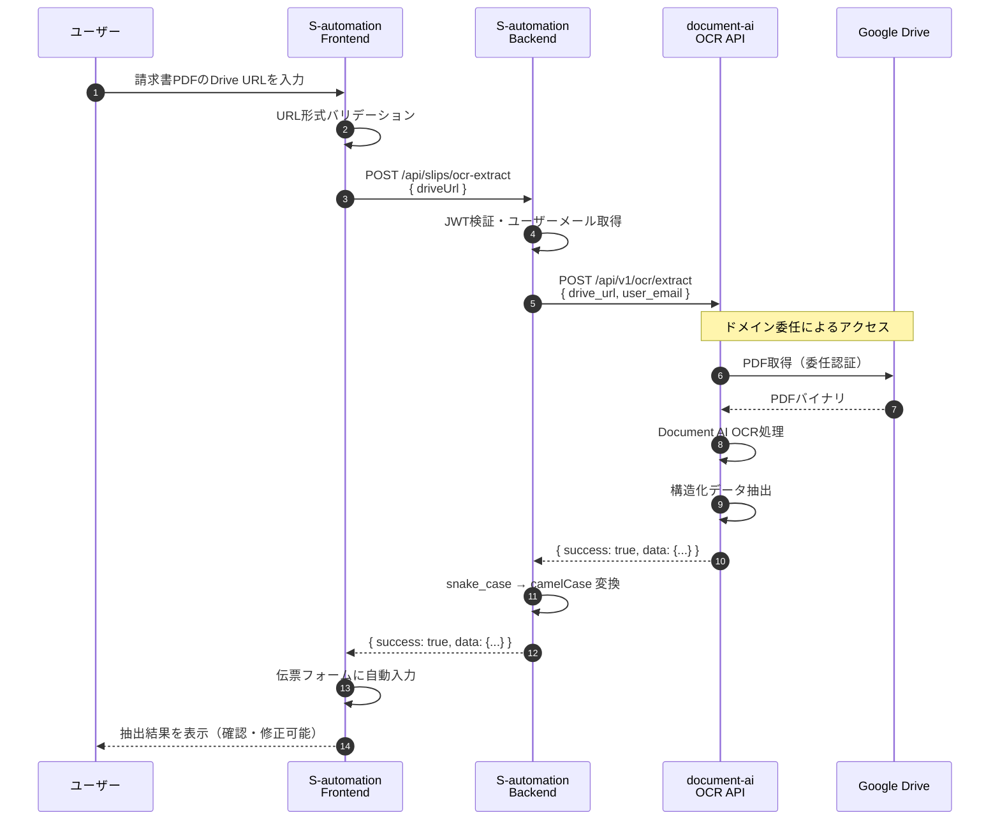
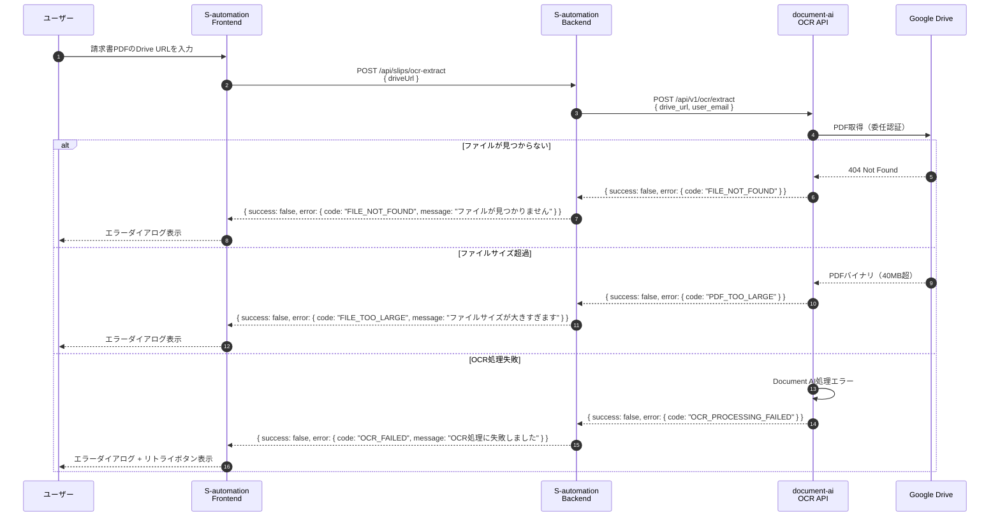
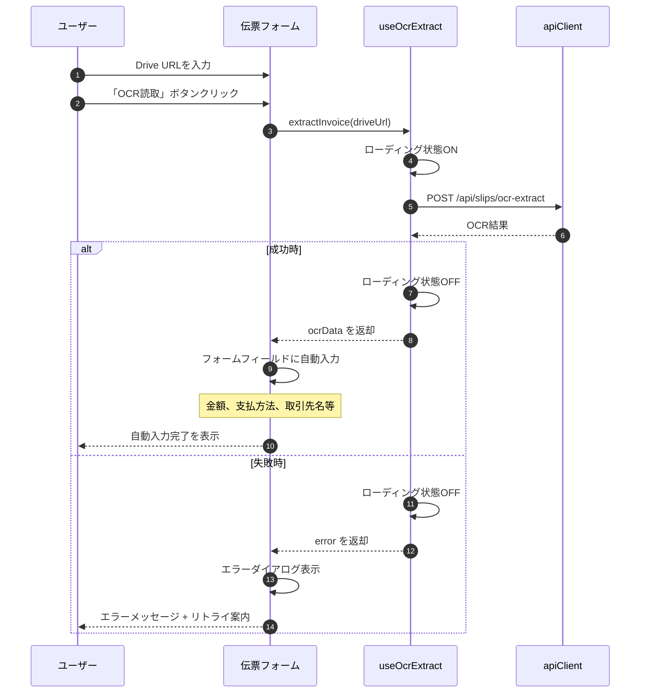

# OcrService設計書

> **Version**: 1.0.0
> **Created**: 2026-03-03
> **Parent**: cmd_177 Gドライブ連携実装
> **Author**: ashigaru5

---

## 1. OcrService設計

### 1.1 概要

OcrServiceは、S-automationバックエンドから既存OCR API（document-ai）を呼び出し、
Google Drive上の請求書PDFからデータを自動抽出するサービスである。

**特徴**:
- ドメイン委任方式: OCR APIがGドライブに直接アクセス
- S-automationはDrive APIを直接操作しない（認証の複雑さを回避）
- OCR結果をフロントエンドに返却し、伝票フォームに自動入力

### 1.2 API呼び出し仕様

#### 外部API情報

| 項目 | 値 |
|------|------|
| エンドポイント | `POST /api/v1/ocr/extract` |
| ベースURL | 環境変数 `OCR_API_URL` |
| 認証 | Bearer Token（`OCR_API_KEY`） |
| Content-Type | `application/json` |

#### S-automation内部API

S-automationが公開するAPIエンドポイント:

```
POST /api/slips/ocr-extract
```

| 項目 | 値 |
|------|------|
| 認証 | JWT（S-automation認証） |
| 権限 | 全ロール（admin, user） |

### 1.3 リクエスト/レスポンス形式

#### S-automation内部API リクエスト

```typescript
// POST /api/slips/ocr-extract
interface OcrExtractRequestDto {
  driveUrl: string;    // Google DriveのファイルURL
}
```

**バリデーション**:
- `driveUrl`: 必須、URL形式、`drive.google.com` ドメインであること

**注意**: `user_email` はバックエンドで自動取得（JWTからログインユーザーのメールを抽出）

#### 外部OCR API リクエスト

```typescript
// OcrService → document-ai API
interface OcrApiRequest {
  drive_url: string;    // Google DriveのファイルURL
  user_email: string;   // 委任対象のユーザーメールアドレス
}
```

#### 外部OCR API レスポンス

```typescript
interface OcrApiResponse {
  success: boolean;
  data?: OcrExtractedData;
  error?: OcrApiError;
  extraction_details?: OcrExtractionDetails;
}

interface OcrExtractedData {
  invoice_issue_date: string | null;        // 請求書発行日（YYYY/MM/DD）
  pay_method: string | null;                // 支払方法
  pay_amt_excl_tax: number | null;          // 税抜金額
  pay_amt_incl_tax: number | null;          // 税込金額
  pay_tax_amt: number | null;               // 消費税額
  inv_receipt_method: string | null;        // 受領方法
  supplier_name: string | null;             // 請求元会社名
  qualified_invoice_number: string | null;  // 適格請求書番号（T番号）
}

interface OcrApiError {
  code: string;
  message: string;
}

interface OcrExtractionDetails {
  invoice_issue_date_source: string;
  pay_method_source: string;
  pay_method_confidence: number;
  pay_amt_incl_tax_source: string;
  pay_amt_excl_tax_source: string;
  pay_tax_amt_source: string;
}
```

#### S-automation内部API レスポンス

```typescript
// POST /api/slips/ocr-extract レスポンス
interface OcrExtractResponseDto {
  success: boolean;
  data?: {
    invoiceIssueDate: string | null;    // camelCase変換
    payMethod: string | null;
    payAmtExclTax: number | null;
    payAmtInclTax: number | null;
    payTaxAmt: number | null;
    supplierName: string | null;
    qualifiedInvoiceNumber: string | null;
  };
  error?: {
    code: string;
    message: string;
  };
}
```

**注意**: 外部API（snake_case）→ 内部API（camelCase）変換を行う

### 1.4 エラーハンドリング

#### エラー分類

| カテゴリ | HTTPステータス | 対応 |
|---------|---------------|------|
| バリデーションエラー | 400 Bad Request | フロントでエラー表示 |
| 認証エラー | 401 Unauthorized | ログイン画面へリダイレクト |
| 権限エラー | 403 Forbidden | エラー表示 |
| OCR APIエラー | 502 Bad Gateway | リトライまたはエラー表示 |
| タイムアウト | 504 Gateway Timeout | リトライ推奨 |

#### OCR APIエラーコード対応表

| OCR APIエラーコード | S-automation内部コード | ユーザーメッセージ |
|--------------------|----------------------|-----------------|
| INVALID_DRIVE_URL | INVALID_URL | 無効なURLです |
| INVALID_USER_EMAIL | INVALID_EMAIL | メールアドレスが無効です |
| DELEGATION_ERROR | DELEGATION_ERROR | アクセス権限がありません |
| FILE_NOT_FOUND | FILE_NOT_FOUND | ファイルが見つかりません |
| PDF_DOWNLOAD_FAILED | DOWNLOAD_FAILED | ダウンロードに失敗しました |
| PDF_TOO_LARGE | FILE_TOO_LARGE | ファイルサイズが大きすぎます（40MB以下） |
| PDF_TOO_MANY_PAGES | TOO_MANY_PAGES | ページ数が多すぎます（30ページ以下） |
| OCR_PROCESSING_FAILED | OCR_FAILED | OCR処理に失敗しました |
| EXTRACTION_FAILED | EXTRACTION_FAILED | データ抽出に失敗しました |

#### リトライポリシー

```typescript
const RETRY_CONFIG = {
  maxRetries: 2,
  retryDelay: 1000,  // 1秒
  retryableErrors: [
    'OCR_PROCESSING_FAILED',
    'EXTRACTION_FAILED',
  ],
};
```

### 1.5 OcrService実装設計

```typescript
// src/modules/slips/services/ocr.service.ts

import { Injectable, Logger, HttpException, HttpStatus } from '@nestjs/common';
import { ConfigService } from '@nestjs/config';

@Injectable()
export class OcrService {
  private readonly logger = new Logger(OcrService.name);
  private readonly apiUrl: string;
  private readonly apiKey: string;

  constructor(private readonly configService: ConfigService) {
    this.apiUrl = this.configService.get<string>('OCR_API_URL');
    this.apiKey = this.configService.get<string>('OCR_API_KEY');
  }

  async extractInvoiceData(
    driveUrl: string,
    userEmail: string,
  ): Promise<OcrExtractResponseDto> {
    this.logger.log(`OCR extract request: ${driveUrl}`);

    try {
      const response = await fetch(`${this.apiUrl}/api/v1/ocr/extract`, {
        method: 'POST',
        headers: {
          'Authorization': `Bearer ${this.apiKey}`,
          'Content-Type': 'application/json',
        },
        body: JSON.stringify({
          drive_url: driveUrl,
          user_email: userEmail,
        }),
      });

      if (!response.ok) {
        throw new HttpException(
          'OCR API request failed',
          HttpStatus.BAD_GATEWAY,
        );
      }

      const result: OcrApiResponse = await response.json();

      if (!result.success) {
        return {
          success: false,
          error: {
            code: this.mapErrorCode(result.error?.code),
            message: this.mapErrorMessage(result.error?.code),
          },
        };
      }

      // snake_case → camelCase 変換
      return {
        success: true,
        data: {
          invoiceIssueDate: result.data.invoice_issue_date,
          payMethod: result.data.pay_method,
          payAmtExclTax: result.data.pay_amt_excl_tax,
          payAmtInclTax: result.data.pay_amt_incl_tax,
          payTaxAmt: result.data.pay_tax_amt,
          supplierName: result.data.supplier_name,
          qualifiedInvoiceNumber: result.data.qualified_invoice_number,
        },
      };
    } catch (error) {
      this.logger.error(`OCR API error: ${error.message}`);
      throw new HttpException(
        'OCR processing failed',
        HttpStatus.BAD_GATEWAY,
      );
    }
  }

  private mapErrorCode(ocrCode: string): string {
    const mapping: Record<string, string> = {
      INVALID_DRIVE_URL: 'INVALID_URL',
      INVALID_USER_EMAIL: 'INVALID_EMAIL',
      FILE_NOT_FOUND: 'FILE_NOT_FOUND',
      PDF_DOWNLOAD_FAILED: 'DOWNLOAD_FAILED',
      PDF_TOO_LARGE: 'FILE_TOO_LARGE',
      PDF_TOO_MANY_PAGES: 'TOO_MANY_PAGES',
      OCR_PROCESSING_FAILED: 'OCR_FAILED',
      EXTRACTION_FAILED: 'EXTRACTION_FAILED',
    };
    return mapping[ocrCode] || 'UNKNOWN_ERROR';
  }

  private mapErrorMessage(ocrCode: string): string {
    const messages: Record<string, string> = {
      INVALID_DRIVE_URL: '無効なURLです',
      INVALID_USER_EMAIL: 'メールアドレスが無効です',
      DELEGATION_ERROR: 'アクセス権限がありません',
      FILE_NOT_FOUND: 'ファイルが見つかりません',
      PDF_DOWNLOAD_FAILED: 'ダウンロードに失敗しました',
      PDF_TOO_LARGE: 'ファイルサイズが大きすぎます（40MB以下）',
      PDF_TOO_MANY_PAGES: 'ページ数が多すぎます（30ページ以下）',
      OCR_PROCESSING_FAILED: 'OCR処理に失敗しました',
      EXTRACTION_FAILED: 'データ抽出に失敗しました',
    };
    return messages[ocrCode] || '不明なエラーが発生しました';
  }
}
```

---

## 2. シーケンス図

### 2.1 OCR処理フロー（Mermaid）

#### 正常系フロー



#### エラー系フロー



### 2.2 フロントエンド処理詳細



---

## 3. 補足情報

### 3.1 環境変数

| 変数名 | 説明 | 例 |
|--------|------|-----|
| OCR_API_URL | OCR APIのベースURL | https://invoice-ocr-api-xxxx.run.app |
| OCR_API_KEY | API認証キー | sk-xxxxxxxx |

### 3.2 制限事項

| 項目 | 制限値 |
|------|--------|
| ファイルサイズ | 40MB以下 |
| ページ数 | 30ページ以下 |
| 対応形式 | PDFのみ |
| ドメイン制限 | @yuidea.co.jp のみ |

### 3.3 関連ファイル

| ファイル | 説明 |
|----------|------|
| src/modules/slips/services/ocr.service.ts | OcrService本体 |
| src/modules/slips/dto/ocr-extract.dto.ts | リクエスト/レスポンスDTO |
| src/modules/slips/slips.controller.ts | エンドポイント定義 |

---

**End of Design Document**
