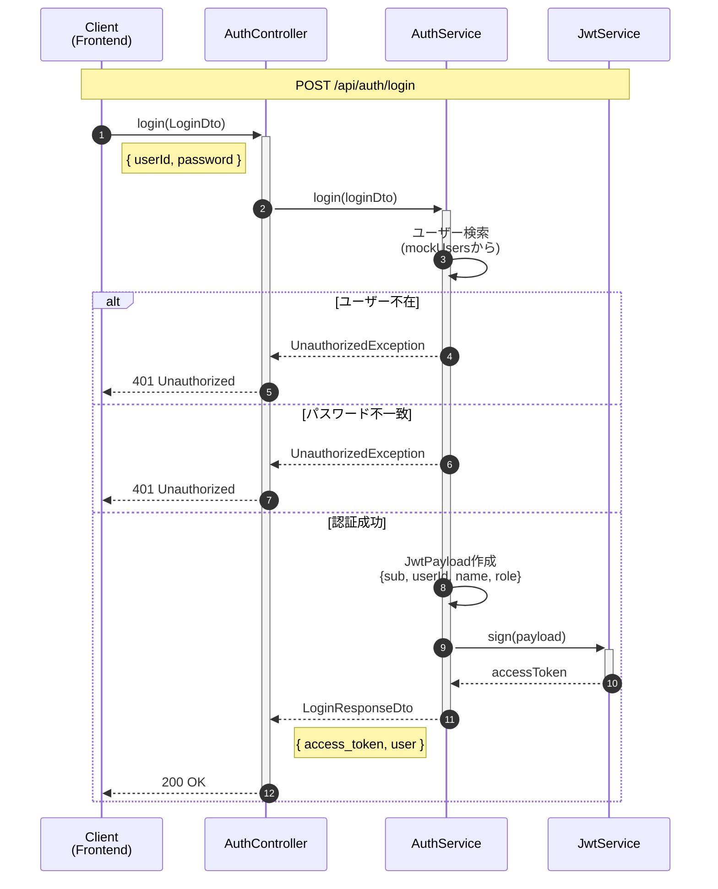
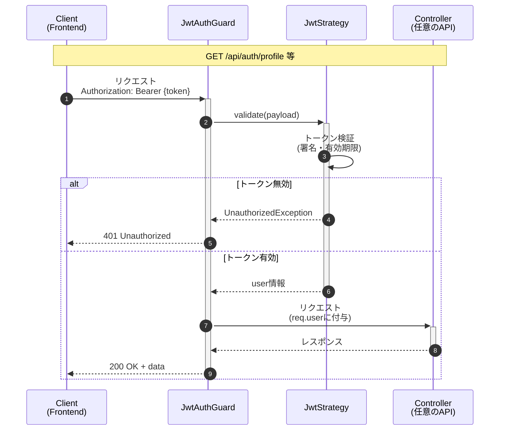
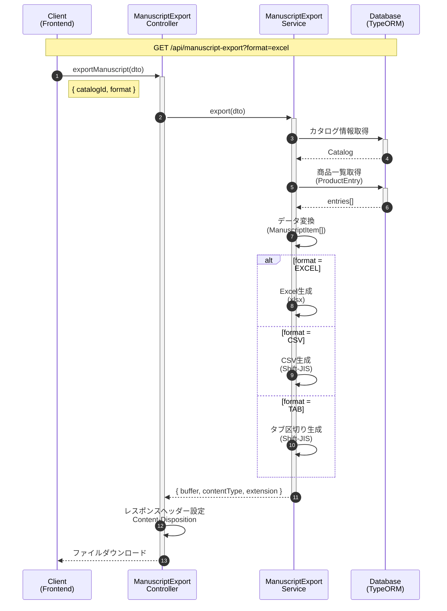
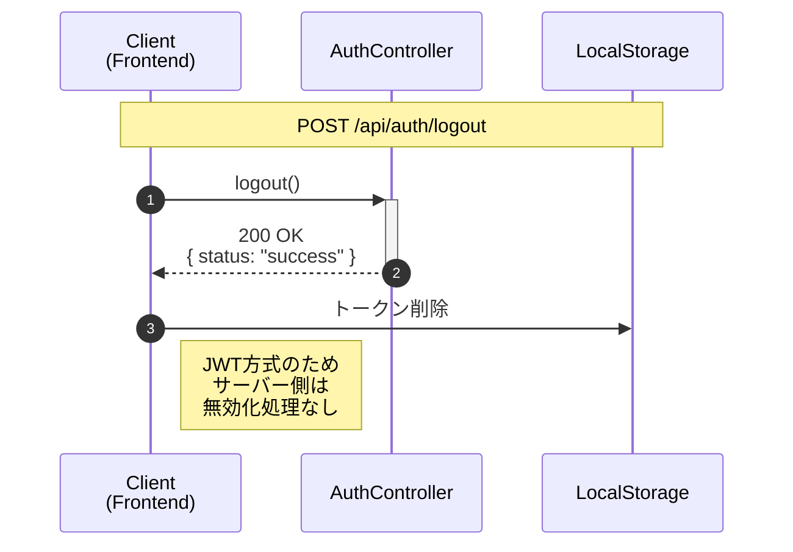

# arms-mock シーケンス図

> 作成日: 2026-02-13
> 作成者: 軍師 (cmd_025)

## 1. 認証フロー（ログイン）

## 2. 認証済みAPI呼び出しフロー

## 3. 原稿エクスポートフロー

## 4. ログアウトフロー

---

## 補足

### エンドポイント一覧（認証関連）

| エンドポイント | メソッド | 認証 | 説明 |
|---------------|---------|------|------|
| `/api/auth/login` | POST | 不要 | ログイン・JWT発行 |
| `/api/auth/profile` | GET | 必要 | ユーザー情報取得 |
| `/api/auth/verify` | GET | 必要 | トークン有効性確認 |
| `/api/auth/logout` | POST | 不要 | ログアウト |

### エンドポイント一覧（原稿エクスポート）

| エンドポイント | メソッド | 認証 | 説明 |
|---------------|---------|------|------|
| `/api/manuscript-export` | GET | 不要* | 汎用エクスポート |
| `/api/manuscript-export/excel` | GET | 不要* | Excel形式 |
| `/api/manuscript-export/csv` | GET | 不要* | CSV形式 |
| `/api/manuscript-export/tab` | GET | 不要* | タブ区切り形式 |
| `/api/manuscript-export/preview` | GET | 不要* | プレビュー（JSON） |

*モック環境のため認証不要（bug_036対応）

### ユーザーロール

| ロール | 説明 |
|--------|------|
| `admin` | システム管理者 |
| `editor` | 編集者 |
| `viewer` | 閲覧者 |
| `approver` | 承認者 |
| `operator` | オペレーター |
