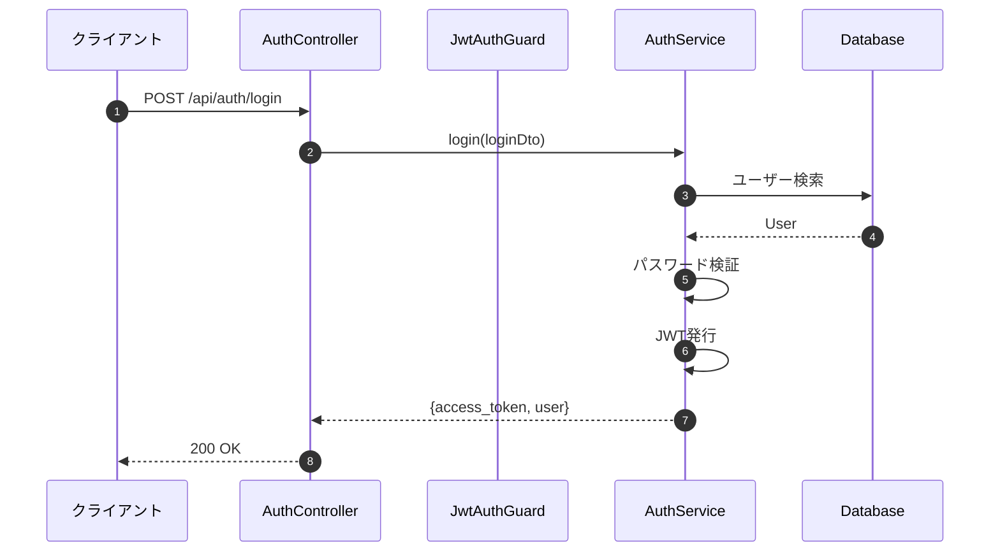

# スキル使用例集

> 「こういう時、どのスキルを使えばいいの？」を解決する実践ガイド

---

## 例1: シーケンス図を作りたい

**シーン**: NestJSバックエンドの認証フローを図面化したい

### 使用スキル

**`/mermaid-sequence-generator`**

### 呼び出し方

```bash
/mermaid-sequence-generator ~/arms-mock/backend/src/ --module auth --include-guards
```

### 入力

| 項目 | 値 |
|------|-----|
| プロジェクトディレクトリ | `~/arms-mock/backend/src/` |
| オプション | `--module auth` （認証モジュールのみ） |
| オプション | `--include-guards` （Guard/Strategy含む） |

### 出力



### 活用シーン

- 新メンバーへのオンボーディング
- 設計レビュー資料作成
- API仕様書の補足資料
- バグ調査時の処理フロー確認

---

## 例2: CRUDページを作りたい

**シーン**: 商品マスタの一覧・詳細・編集画面を作りたい

### 使用スキル

**`/react-mui-crud-scaffold`**

### 呼び出し方

```bash
/react-mui-crud-scaffold api_schema.md --entity Product --output src/
```

### 入力

| 項目 | 値 |
|------|-----|
| API Schema定義 | `api_schema.md`（エンドポイント、リクエスト/レスポンス型） |
| エンティティ名 | `Product` |
| 出力先 | `src/` |

### 出力

```
生成ファイル（6ファイル）:
├── types/product.ts           # 型定義（インターフェース、定数）
├── services/productService.ts # APIサービス（CRUD操作）
├── components/
│   ├── ProductTable.tsx       # 一覧テーブル（DataGrid）
│   └── ProductForm.tsx        # 編集フォーム（タブ対応）
└── pages/
    ├── ProductListPage.tsx    # 一覧ページ（検索機能付き）
    └── ProductDetailPage.tsx  # 詳細ページ
```

### 生成コードの特徴

- **TypeScript完全対応**: 型定義が自動生成される
- **MUI DataGrid**: ソート・ページネーション付きテーブル
- **TanStack Query**: サーバー状態管理
- **タブ対応フォーム**: フィールド数が多い場合は自動でタブ分割

### 活用シーン

- 新規管理画面の雛形作成
- API仕様書からのフロントエンド自動生成
- プロトタイプ/モック画面の短期作成

---

## 例3: セキュリティ診断したい

**シーン**: .NETアプリケーションの脆弱性をチェックしたい

### 使用スキル

**`/dotnet-security-audit`**

### 呼び出し方

```bash
/dotnet-security-audit ~/AssetsManageSystem/
```

### 入力

| 項目 | 値 |
|------|-----|
| プロジェクトディレクトリ | `~/AssetsManageSystem/` |

### 出力

```yaml
# Security Audit Report
project: "AssetsManageSystem"
audit_date: "2026-02-13T10:00:00"

summary:
  critical: 2
  high: 3
  medium: 5
  low: 2

findings:
  - id: VULN-001
    severity: critical
    category: "認証認可"
    title: "UseAuthentication() が見つからない"
    file: "Program.cs"
    remediation: "app.UseAuthentication() を追加せよ"

  - id: VULN-002
    severity: high
    category: "機密情報"
    title: "appsettings.json にパスワード平文"
    file: "appsettings.json:15"
    remediation: "User Secrets または 環境変数を使用せよ"
```

### チェック項目

| カテゴリ | チェック内容 |
|----------|-------------|
| **認証認可** | UseAuthentication, UseAuthorization, [Authorize]属性 |
| **機密情報** | ConnectionString, APIキー, JWTシークレットの露出 |
| **ログ設定** | EnableSensitiveDataLogging, EnableDetailedErrors |
| **セキュリティ設定** | HTTPS強制, HSTS, CORS, AntiForgeryToken |

### 活用シーン

- リリース前のセキュリティチェック
- 既存アプリケーションの脆弱性調査
- コードレビュー時のセキュリティ確認

---

## 例4: Entityの整合性確認したい

**シーン**: TypeORMプロジェクトで重複Entityや型不一致を検出したい

### 使用スキル

**`/typeorm-entity-checker`**

### 呼び出し方

```bash
/typeorm-entity-checker ~/arms-mock/backend/src/ --verbose
```

### 入力

| 項目 | 値 |
|------|-----|
| srcディレクトリ | `~/arms-mock/backend/src/` |
| オプション | `--verbose` （詳細出力） |

### 出力

```
TypeORM Entity Check Report
═══════════════════════════════════════════════════════════

❌ 重複Entity検出: products テーブル (2 files)
   - src/entities/product.entity.ts
   - src/product/entities/product.entity.ts

⚠️ 型不一致検出: product_type_flg
   - src/entities/product.entity.ts: smallint
   - src/product/entities/product.entity.ts: int

✅ catalog テーブル: 正常（1ファイル）
✅ users テーブル: 正常（1ファイル）
✅ vendors テーブル: 正常（1ファイル）

═══════════════════════════════════════════════════════════
Summary
═══════════════════════════════════════════════════════════
Total entities: 15
Duplicates: 1
Type mismatches: 1
OK: 13
```

### 検出機能

| 機能 | 説明 |
|------|------|
| **重複Entity検出** | 同一テーブル名を定義する複数ファイルを検出 |
| **型不一致検出** | 同一カラムで型が異なる定義を検出 |
| **正常Entity確認** | 問題のないEntityも一覧表示 |

### 活用シーン

- Entity追加・変更時のチェック
- CI/CDパイプラインでの自動チェック
- pre-commitフックでの検証
- 「1600カラム問題」のような重複Entity問題の未然防止

---

## スキル検索の方法

「どのスキルを使えばいいか分からない」場合は、以下のコマンドで検索できる：

```bash
# キーワードでスキル検索
~/multi-agent-shogun/bin/search-skills.sh react

# 出力例:
# react-mui-crud-scaffold.md
# react-file-download.md
# react-tag-management-ui.md
# react-layout-template-generator.md
```

---

## 関連ドキュメント

- [スキル一覧](./skill-catalog.md) - 全46スキルの一覧
- [基本的な呼び出し方](./skill-basics.md) - スキルの基本操作
- [よくある質問](./skill-faq.md) - トラブルシューティング

---

**作成日**: 2026-02-13
**作成者**: 足軽3号（cmd_041）
